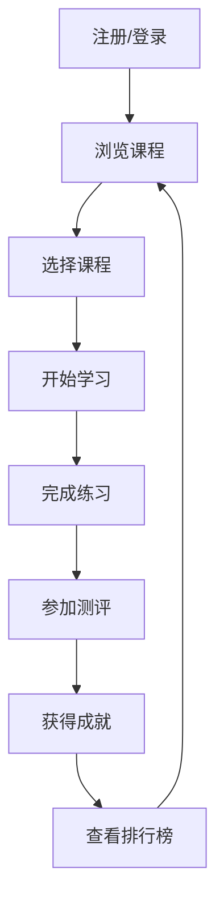

# 数据分析在线教育平台 - 产品需求文档

## 1. 产品概览
数据分析在线教育平台是一款专为商务数据分析与应用专业学生设计的在线学习系统，提供完整的课程体系、互动式学习模块和成就激励系统。
- 解决商务数据分析专业学生缺乏系统化学习资源和实践环境的问题，帮助学生掌握数据分析技能。
- 目标用户为商务数据分析与应用专业的学生，以及对数据分析感兴趣的学习者。

## 2. 核心功能

### 2.1 用户角色
| 角色 | 注册方式 | 核心权限 |
|------|---------------------|------------------|
| 学生 | 邮箱注册 | 浏览课程、学习内容、完成练习和测评、查看成就 |
| 管理员 | 邀请码注册 | 管理课程内容、查看学生进度、管理成就系统 |

### 2.2 功能模块
1. **首页**：平台介绍、课程分类、推荐课程、成就展示
2. **课程中心**：完整课程体系、课程详情、学习进度
3. **学习模块**：互动式学习内容、练习系统、测评系统
4. **成就系统**：成就展示、排行榜、徽章系统
5. **个人中心**：学习进度、个人成就、设置

### 2.3 页面详情
| 页面名称 | 模块名称 | 功能描述 |
|-----------|-------------|---------------------|
| 首页 | 平台介绍 | 展示平台特色、核心功能和价值主张 |
| 首页 | 课程分类 | 按主题和难度分类展示课程 |
| 首页 | 推荐课程 | 根据用户兴趣和学习历史推荐相关课程 |
| 首页 | 成就展示 | 展示用户最近获得的成就和徽章 |
| 课程中心 | 课程列表 | 展示所有课程，支持筛选和搜索 |
| 课程中心 | 课程详情 | 展示课程内容、难度、学习时长和用户评价 |
| 学习模块 | 互动学习 | 提供交互式学习内容，包括视频、文本和实践案例 |
| 学习模块 | 练习系统 | 提供编程练习、数据分析案例和实操任务 |
| 学习模块 | 测评系统 | 提供单元测试、综合测评和技能认证 |
| 成就系统 | 成就展示 | 展示用户获得的所有成就和徽章 |
| 成就系统 | 排行榜 | 展示用户在平台的排名和比较数据 |
| 成就系统 | 徽章系统 | 提供不同级别的徽章和解锁条件 |
| 个人中心 | 学习进度 | 展示用户的学习进度和完成情况 |
| 个人中心 | 个人成就 | 展示用户获得的所有成就和徽章 |
| 个人中心 | 设置 | 提供用户信息管理、通知设置等功能 |

## 3. 核心流程
用户注册/登录 → 浏览课程 → 选择课程 → 开始学习 → 完成练习 → 参加测评 → 获得成就 → 查看排行榜

## 4. 用户界面设计
### 4.1 设计风格
- 主色调：蓝色系 (#165DFF) 和白色 (#FFFFFF)，辅助色：浅灰 (#F5F7FA) 和深灰 (#333333)
- 按钮风格：圆角矩形，主按钮使用蓝色填充，次要按钮使用边框样式
- 字体：无衬线字体，标题使用 18-24px，正文使用 14-16px
- 布局风格：卡片式布局，清晰的信息层级，响应式设计
- 图标风格：线性图标，简洁现代

### 4.2 页面设计概览
| 页面名称 | 模块名称 | UI元素 |
|-----------|-------------|-------------|
| 首页 | 平台介绍 | 大标题 + 简短描述 + 行动按钮，使用渐变背景 |
| 首页 | 课程分类 | 卡片式分类，悬停效果，图标 + 文字 |
| 首页 | 推荐课程 | 横向滚动卡片，包含课程封面、标题、难度和评分 |
| 首页 | 成就展示 | 徽章网格布局，动态效果 |
| 课程中心 | 课程列表 | 卡片式布局，支持筛选和排序，包含课程信息 |
| 课程中心 | 课程详情 | 课程封面 + 详细信息 + 章节列表 + 学习按钮 |
| 学习模块 | 互动学习 | 视频播放器 + 文本内容 + 互动练习嵌入 |
| 学习模块 | 练习系统 | 代码编辑器 + 运行按钮 + 结果展示 |
| 学习模块 | 测评系统 | 题目列表 + 答题界面 + 提交按钮 |
| 成就系统 | 成就展示 | 徽章墙，按类别分组，解锁/未解锁状态 |
| 成就系统 | 排行榜 | 表格布局，显示排名、用户名和分数 |
| 个人中心 | 学习进度 | 进度条 + 完成率统计 + 最近学习 |

### 4.3 响应式设计
- 桌面优先设计，同时支持平板和移动设备
- 移动端适配：单列布局，简化导航为汉堡菜单
- 触控优化：增大点击区域，支持滑动操作

### 4.4 3D场景指导（不适用）
本项目不包含3D场景需求。