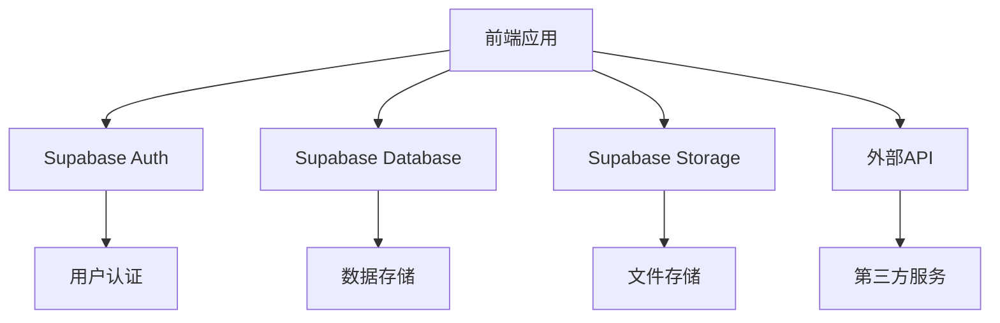
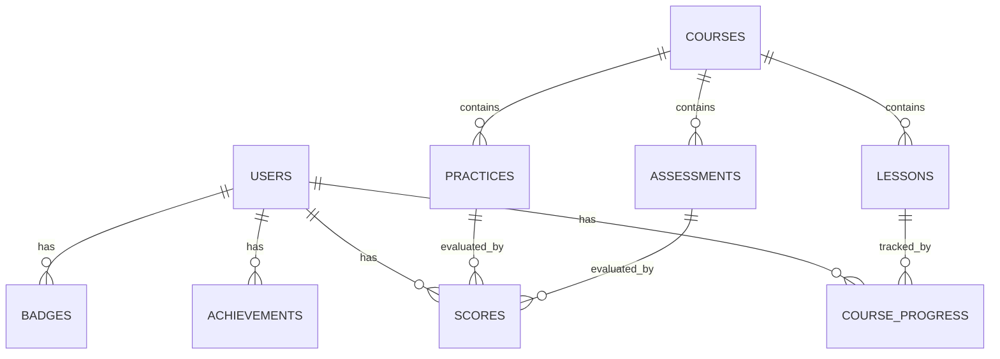

# 数据分析在线教育平台 - 技术架构文档

## 1. 架构设计


## 2. 技术描述
- 前端：React@18 + TypeScript + Tailwind CSS@3 + Vite
- 初始化工具：vite-init
- 后端：Supabase（提供认证、数据库和存储服务）
- 数据库：Supabase PostgreSQL
- 外部服务：Python沙箱环境（用于运行数据分析代码）

## 3. 路由定义
| 路由 | 用途 |
|-------|---------|
| / | 首页 |
| /courses | 课程中心 |
| /courses/:id | 课程详情 |
| /learn/:courseId/:lessonId | 学习模块 |
| /practice/:courseId | 练习系统 |
| /assessment/:courseId | 测评系统 |
| /achievements | 成就系统 |
| /profile | 个人中心 |
| /login | 登录页 |
| /register | 注册页 |

## 4. API定义
### 4.1 前端API调用
- Supabase Auth API：用户注册、登录、退出
- Supabase Database API：课程、学习进度、成就数据的CRUD操作
- Supabase Storage API：课程资源文件的上传和下载

### 4.2 后端API（如果需要）
- Python代码执行API：运行用户提交的数据分析代码
- 评分API：自动评估练习和测评结果

## 5. 数据模型
### 5.1 数据模型定义


### 5.2 数据定义语言
#### 用户表 (users)
```sql
CREATE TABLE users (
  id UUID PRIMARY KEY,
  email TEXT UNIQUE NOT NULL,
  name TEXT NOT NULL,
  role TEXT DEFAULT 'student',
  created_at TIMESTAMP DEFAULT NOW()
);

-- 权限设置
GRANT SELECT ON users TO anon;
GRANT ALL PRIVILEGES ON users TO authenticated;
```

#### 课程表 (courses)
```sql
CREATE TABLE courses (
  id SERIAL PRIMARY KEY,
  title TEXT NOT NULL,
  description TEXT,
  difficulty TEXT NOT NULL,
  duration INTEGER,
  cover_image TEXT,
  created_at TIMESTAMP DEFAULT NOW()
);

-- 权限设置
GRANT SELECT ON courses TO anon;
GRANT ALL PRIVILEGES ON courses TO authenticated;
```

#### 课程章节表 (lessons)
```sql
CREATE TABLE lessons (
  id SERIAL PRIMARY KEY,
  course_id INTEGER REFERENCES courses(id),
  title TEXT NOT NULL,
  content TEXT,
  video_url TEXT,
  order_index INTEGER,
  created_at TIMESTAMP DEFAULT NOW()
);

-- 权限设置
GRANT SELECT ON lessons TO anon;
GRANT ALL PRIVILEGES ON lessons TO authenticated;
```

#### 练习表 (practices)
```sql
CREATE TABLE practices (
  id SERIAL PRIMARY KEY,
  course_id INTEGER REFERENCES courses(id),
  title TEXT NOT NULL,
  description TEXT,
  difficulty TEXT,
  created_at TIMESTAMP DEFAULT NOW()
);

-- 权限设置
GRANT SELECT ON practices TO anon;
GRANT ALL PRIVILEGES ON practices TO authenticated;
```

#### 测评表 (assessments)
```sql
CREATE TABLE assessments (
  id SERIAL PRIMARY KEY,
  course_id INTEGER REFERENCES courses(id),
  title TEXT NOT NULL,
  description TEXT,
  duration INTEGER,
  created_at TIMESTAMP DEFAULT NOW()
);

-- 权限设置
GRANT SELECT ON assessments TO anon;
GRANT ALL PRIVILEGES ON assessments TO authenticated;
```

#### 课程进度表 (course_progress)
```sql
CREATE TABLE course_progress (
  id SERIAL PRIMARY KEY,
  user_id UUID REFERENCES users(id),
  course_id INTEGER REFERENCES courses(id),
  lesson_id INTEGER REFERENCES lessons(id),
  completed BOOLEAN DEFAULT false,
  completed_at TIMESTAMP,
  created_at TIMESTAMP DEFAULT NOW()
);

-- 权限设置
GRANT SELECT ON course_progress TO anon;
GRANT ALL PRIVILEGES ON course_progress TO authenticated;
```

#### 成就表 (achievements)
```sql
CREATE TABLE achievements (
  id SERIAL PRIMARY KEY,
  name TEXT NOT NULL,
  description TEXT,
  icon TEXT,
  difficulty TEXT,
  created_at TIMESTAMP DEFAULT NOW()
);

-- 权限设置
GRANT SELECT ON achievements TO anon;
GRANT ALL PRIVILEGES ON achievements TO authenticated;
```

#### 用户成就表 (user_achievements)
```sql
CREATE TABLE user_achievements (
  id SERIAL PRIMARY KEY,
  user_id UUID REFERENCES users(id),
  achievement_id INTEGER REFERENCES achievements(id),
  unlocked_at TIMESTAMP DEFAULT NOW()
);

-- 权限设置
GRANT SELECT ON user_achievements TO anon;
GRANT ALL PRIVILEGES ON user_achievements TO authenticated;
```

#### 徽章表 (badges)
```sql
CREATE TABLE badges (
  id SERIAL PRIMARY KEY,
  name TEXT NOT NULL,
  description TEXT,
  icon TEXT,
  level TEXT,
  created_at TIMESTAMP DEFAULT NOW()
);

-- 权限设置
GRANT SELECT ON badges TO anon;
GRANT ALL PRIVILEGES ON badges TO authenticated;
```

#### 用户徽章表 (user_badges)
```sql
CREATE TABLE user_badges (
  id SERIAL PRIMARY KEY,
  user_id UUID REFERENCES users(id),
  badge_id INTEGER REFERENCES badges(id),
  earned_at TIMESTAMP DEFAULT NOW()
);

-- 权限设置
GRANT SELECT ON user_badges TO anon;
GRANT ALL PRIVILEGES ON user_badges TO authenticated;
```

#### 分数表 (scores)
```sql
CREATE TABLE scores (
  id SERIAL PRIMARY KEY,
  user_id UUID REFERENCES users(id),
  practice_id INTEGER REFERENCES practices(id),
  assessment_id INTEGER REFERENCES assessments(id),
  score INTEGER,
  submitted_at TIMESTAMP DEFAULT NOW()
);

-- 权限设置
GRANT SELECT ON scores TO anon;
GRANT ALL PRIVILEGES ON scores TO authenticated;
```